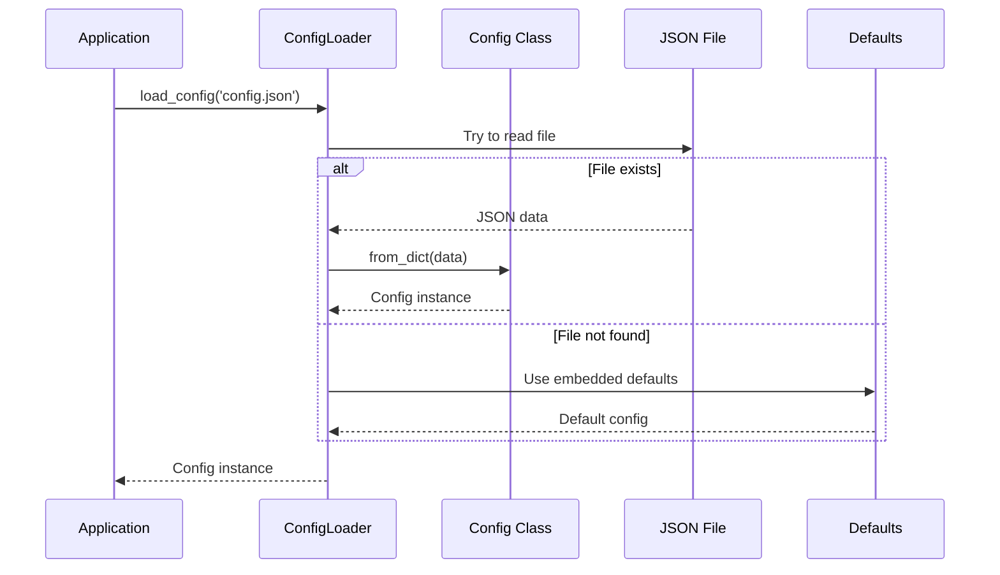
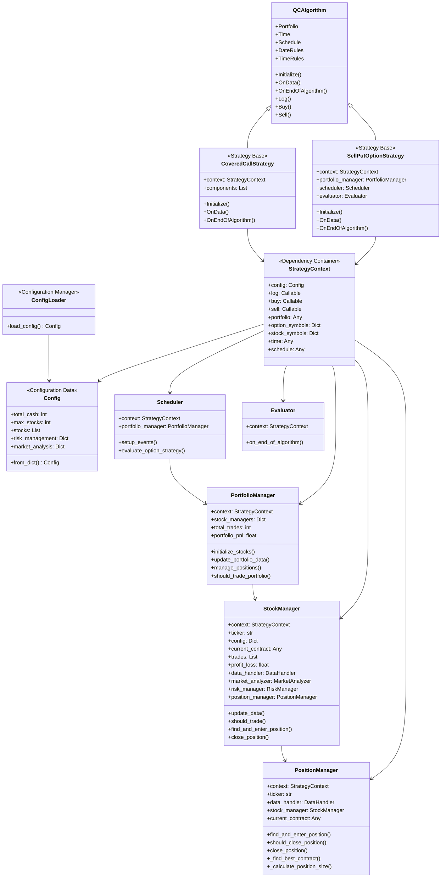
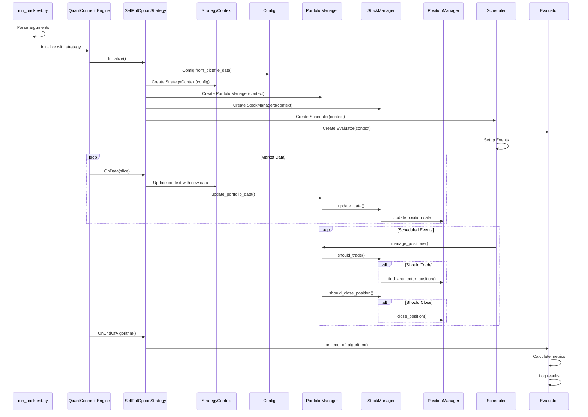

# QuantConnect Strategy Architecture

## Overview

This document describes the architecture of the QuantConnect options trading strategy system. The system is designed with dependency injection using `StrategyContext` to decouple components, enabling better testability and maintainability. The main entry point is `run_backtest.py` which allows easy switching between strategies via CLI arguments.

## Dependency Injection with StrategyContext

The system uses a `StrategyContext` object to inject dependencies into all components, eliminating tight coupling to the main strategy class:

```python
@dataclass
class StrategyContext:
    config: Config
    log: Callable[[str], None]
    buy: Callable
    sell: Callable
    portfolio: Any
    option_symbols: dict
    stock_symbols: dict
    time: Any
    schedule: Any
```

This approach provides:

- **True dependency injection** - Components receive only what they need
- **Better testability** - Easy to mock dependencies in unit tests
- **Reduced coupling** - Components don't inherit from strategy classes
- **Reusability** - Components can be used across different strategies

## Configuration System Architecture

### Simplified Config Design

The system uses a clean, dataclass-based configuration system:

```python
@dataclass
class Config:
    # Portfolio settings
    total_cash: Optional[int] = None
    max_stocks: Optional[int] = None
    max_portfolio_risk: Optional[float] = None
    max_drawdown: Optional[float] = None
    correlation_threshold: Optional[float] = None

    # Stock configurations
    stocks: List[Dict[str, Any]] = field(default_factory=list)

    # Risk management settings
    volatility_lookback: Optional[int] = None
    volatility_threshold: Optional[float] = None
    correlation_lookback: Optional[int] = None

    # Market analysis settings
    rsi_period: Optional[int] = None
    moving_average_period: Optional[int] = None
    market_volatility_lookback: Optional[int] = None

    # Legacy single-stock settings
    ticker: Optional[str] = None
    target_delta_min: Optional[float] = None
    target_delta_max: Optional[float] = None
    max_position_size: Optional[float] = None
    option_frequency: Optional[str] = None
    start_date: Optional[str] = None
    end_date: Optional[str] = None

    @classmethod
    def from_dict(cls, data: Dict[str, Any]) -> 'Config':
        """Create a Config instance from a dictionary with sensible defaults."""
        # Handle nested structure where config is under "parameters" key
        if 'parameters' in data:
            data = data['parameters']

        # Extract values from nested structure
        portfolio = data.get('portfolio', {})
        risk = data.get('risk_management', {})
        market = data.get('market_analysis', {})

        return cls(
            # Portfolio settings with defaults
            total_cash=portfolio.get('total_cash', 100000),
            max_stocks=portfolio.get('max_stocks', 1),
            max_portfolio_risk=portfolio.get('max_portfolio_risk', 0.02),
            max_drawdown=portfolio.get('max_drawdown', 0.15),
            correlation_threshold=portfolio.get('correlation_threshold', 0.7),

            # Stocks configuration
            stocks=data.get('stocks', []),

            # Risk management settings with defaults
            volatility_lookback=risk.get('volatility_lookback', 20),
            volatility_threshold=risk.get('volatility_threshold', 0.4),
            correlation_lookback=risk.get('correlation_lookback', 60),

            # Market analysis settings with defaults
            rsi_period=market.get('rsi_period', 14),
            moving_average_period=market.get('moving_average_period', 50),
            market_volatility_lookback=market.get('volatility_lookback', 20),

            # Legacy single-stock settings with defaults
            ticker=data.get('ticker', 'AAPL'),
            target_delta_min=data.get('target_delta_min', 0.25),
            target_delta_max=data.get('target_delta_max', 0.75),
            max_position_size=data.get('max_position_size', 0.20),
            option_frequency=data.get('option_frequency', 'monthly'),
            start_date=data.get('start_date', '2020-01-01'),
            end_date=data.get('end_date', '2025-01-01')
        )
```

### Configuration Loading Flow



### Configuration Benefits

- **Self-contained**: All configuration logic in the dataclass
- **Type-safe**: Proper typing with dataclass fields
- **Default values**: Sensible defaults built into the system
- **Flexible**: Supports both file-based and embedded configuration
- **Extensible**: Easy to add new configuration fields

## Entry Point: run_backtest.py

The main entry point is `run_backtest.py` which provides a clean CLI interface:

```bash
# Run sell put strategy
lean backtest run_backtest.py

# Run with specific configuration
lean backtest run_backtest.py --config sell_put_stock.json

# Run covered call strategy
lean backtest run_backtest.py --strategy covered_call
```

## Class Hierarchy



## Data Flow Architecture



## Key Design Principles

### 1. Dependency Injection Pattern

- **StrategyContext** contains all shared dependencies (config, logging, trading methods, etc.)
- **Components receive context** instead of inheriting from strategy classes
- **Clean separation** between strategy logic and component logic
- **Easy testing** - mock the context for unit tests

### 2. Single Responsibility

- **Strategy class**: Main strategy logic and coordination
- **PortfolioManager**: Portfolio-level management and coordination
- **StockManager**: Individual stock trading logic
- **Scheduler**: Event scheduling and timing
- **Evaluator**: Performance evaluation and reporting
- **Config**: Pure data container with factory method

### 3. Configuration-Driven

- All parameters stored in `Config` object accessible via context
- Easy to modify behavior without code changes
- Support for both file-based and embedded configuration
- Self-contained configuration logic in the dataclass

### 4. Modular Design

- Each component can be tested independently
- Clear interfaces between components
- Easy to extend with new features
- Simplified configuration management

## Component Responsibilities

| Component               | Responsibility              | Dependencies         | Access Method             |
| ----------------------- | --------------------------- | -------------------- | ------------------------- |
| `run_backtest.py`       | CLI entry point             | argparse, strategies | Direct execution          |
| `SellPutOptionStrategy` | Strategy logic              | StrategyContext      | Inherits from QCAlgorithm |
| `StrategyContext`       | Dependency container        | Config, QCAlgorithm  | Injected into components  |
| `Config`                | Configuration data          | None                 | Factory method from_dict  |
| `ConfigLoader`          | Configuration loading       | Config               | Static method load_config |
| `PortfolioManager`      | Portfolio-level management  | StrategyContext      | Receives context          |
| `StockManager`          | Individual stock management | StrategyContext      | Receives context          |
| `PositionManager`       | Position-level management   | StrategyContext      | Receives context          |
| `Scheduler`             | Event scheduling            | StrategyContext      | Receives context          |
| `Evaluator`             | Performance evaluation      | StrategyContext      | Receives context          |

## Usage Examples

### Creating StrategyContext

```python
# In strategy class
def Initialize(self):
    # Load configuration
    config = ConfigLoader.load_config('sell_put_stock.json')

    # Create context with loaded config
    self.context = StrategyContext(
        config=config,
        log=self.Log,
        buy=self.Buy,
        sell=self.Sell,
        portfolio=self.Portfolio,
        option_symbols=self.option_symbols,
        stock_symbols=self.stock_symbols,
        time=self.Time,
        schedule=self.Schedule
    )
```

### Using Context in Components

```python
class PortfolioManager:
    def __init__(self, context: StrategyContext):
        self.context = context
        self.config = context.config
        self.log = context.log
        self.portfolio = context.portfolio

    def manage_positions(self):
        self.log("Managing positions")
        current_value = self.portfolio.TotalPortfolioValue
        max_stocks = self.config.max_stocks
```

### Configuration Usage

```python
# Load configuration from file
config = ConfigLoader.load_config('sell_put_stock.json')

# Access configuration values
total_cash = config.total_cash
max_stocks = config.max_stocks
stock_config = config.stocks[0]

# Create configuration from dictionary
config_data = {
    "parameters": {
        "portfolio": {"total_cash": 100000},
        "stocks": [{"ticker": "AAPL", "enabled": True}]
    }
}
config = Config.from_dict(config_data)
```

## File Structure

```
quantconnet/
├── run_backtest.py                    # Main backtest entry point (Lean)
├── run_cli.py                         # CLI runner for local testing
├── config/
│   ├── common_config_loader.py        # Configuration loading system
│   ├── sell_put_stock.json            # Sell put strategy config
│   ├── covered_call_stock.json        # Covered call strategy config
│   └── backtest.json                  # Lean backtest configuration
├── shared/
│   ├── interfaces/                    # Common interfaces
│   │   ├── __init__.py
│   │   └── strategy_interface.py
│   ├── utils/                         # Shared utilities
│   │   ├── __init__.py
│   │   ├── constants.py
│   │   ├── option_utils.py
│   │   └── position_utils.py
│   ├── analysis/                      # Shared analysis tools
│   │   ├── __init__.py
│   │   ├── market_analysis_types.py
│   │   └── technical_indicators.py
│   └── types/                         # Common type definitions
│       ├── __init__.py
│       └── strategy_types.py
├── strategies/
│   ├── sell_put/
│   │   ├── components/
│   │   │   ├── __init__.py
│   │   │   ├── portfolio_manager.py
│   │   │   ├── stock_manager.py
│   │   │   ├── position_manager.py
│   │   │   ├── evaluator.py
│   │   │   ├── data_handler.py
│   │   │   ├── market_analyzer.py
│   │   │   ├── risk_manager.py
│   │   │   └── scheduler.py
│   │   ├── context.py                 # StrategyContext definition
│   │   └── sell_put_strategy.py       # Main strategy class
│   └── covered_call/
│       ├── components/
│       │   ├── __init__.py
│       │   └── covered_call_manager.py
│       ├── context.py
│       └── covered_call_strategy.py
├── tests/                             # Unit tests
│   ├── __init__.py
│   ├── test_sell_put/
│   └── test_covered_call/
└── .importlinter                      # Import linting configuration
```

## Benefits of This Architecture

1. **Dependency Injection**: True separation of concerns with injected dependencies
2. **Strategy Swapping**: Easily switch between strategies via CLI arguments
3. **Testability**: Components can be tested in isolation with mocked contexts
4. **Maintainability**: Clear separation between strategy logic and components
5. **Reusability**: Components can be shared across different strategies
6. **Configuration**: Flexible, self-contained configuration system
7. **CLI Interface**: Professional command-line interface for running backtests
8. **Modularity**: Each strategy is self-contained with its own components
9. **Type Safety**: Proper typing with dataclasses and type hints
10. **Performance**: Direct method access without inheritance overhead
11. **Simplicity**: Clean, readable configuration management
12. **Extensibility**: Easy to add new configuration fields and components

## Configuration System Benefits

### Before (Complex)

```python
# Bulky update function with repetitive code
def _update_config_from_dict(config: Config, file_config: Dict[str, Any]) -> None:
    if 'portfolio' in file_config:
        portfolio = file_config['portfolio']
        config.total_cash = portfolio.get('total_cash', config.total_cash)
        # ... 30+ lines of repetitive assignment code
```

### After (Simple)

```python
# Clean factory method with built-in defaults
@classmethod
def from_dict(cls, data: Dict[str, Any]) -> 'Config':
    # Handle nested structure
    if 'parameters' in data:
        data = data['parameters']

    # Extract sections
    portfolio = data.get('portfolio', {})
    risk = data.get('risk_management', {})
    market = data.get('market_analysis', {})

    # Create config with defaults
    return cls(
        total_cash=portfolio.get('total_cash', 100000),
        max_stocks=portfolio.get('max_stocks', 1),
        # ... clean, readable assignments
    )
```

## Creating a Strategy

```python
# The strategy automatically creates context and sets up all components
strategy = SellPutOptionStrategy()
strategy.Initialize(start_date, end_date, "config.json")
```

## Accessing Context Properties

```python
# In any component, access dependencies via context
self.context.config.total_cash
self.context.option_symbols
self.context.portfolio.TotalPortfolioValue
```

## Using Context Methods

```python
# In any component, use methods via context
self.context.log("Some message")
self.context.buy(contract, quantity)
self.context.sell(contract, quantity)
```

This architecture provides a clean, maintainable, and extensible foundation for quantitative trading strategies with proper dependency injection, simplified configuration management, CLI interface, and modular design.
